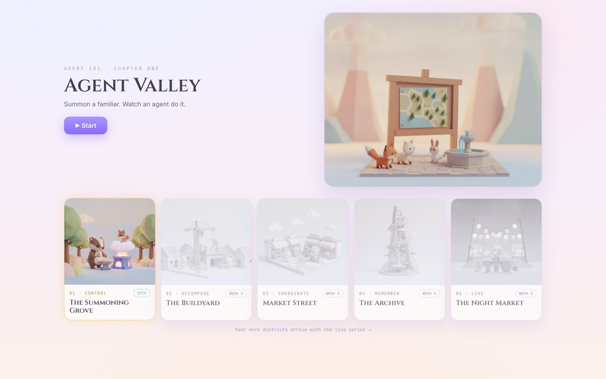

# Agent Valley — chapter one

**What is an agent, really?** You find out by catching one lying, then giving it
hands with a single line of code.

This is a ~30 minute hands-on lab. You summon a creature that did not exist,
dress it up, and watch the state it changed survive a page reload. You edit
**one line**; everything else you read, run and watch.

▶ **Start here: [Run it](#run-it).** The written walkthrough that goes with this
lab is still a draft and lives elsewhere; everything you need to run the thing is
in this repo.



📕 **The slides:** [Agent 101 — ep1](docs/agent-101-ep1.pdf) (29 pages) — the deck
that goes with this lab, from the Agent 101 Live week-one session.

## Run it

```bash
git clone https://github.com/cuppibla/agent-valley-lab
cd agent-valley-lab
uv sync
cp .env.example .env
uv run python scripts/preflight.py
```

`.env.example` defaults to **Vertex AI**, so it picks up whatever project `gcloud`
is pointed at — there is nothing to edit and no key to paste.

Then the lab boots two surfaces, each right before you need it:

```bash
uv run adk web .
```

```bash
bash valley.sh
```

The first is the workbench — the agent raw, on `:8000`. The second is the stage —
the agent on `:8100` and Agent Valley on `:3200`.

## What's in here

| | |
|---|---|
| `grove/agent.py` | the agent you edit — 20 lines, one commented-out line |
| `grove_locked/agent.py` | the finished agent, re-exported so `adk web` lists it too |
| `grove_flow/agent.py` | the same tool wired as a fixed workflow instead |
| `forge/agent/` | the finished agent the valley runs on: tools, callbacks, service |
| `tests/` | offline tests — no model, no key, no network |
| `site/` | Agent Valley itself (Next.js) — already built |

The two lab agents import the *same* tools as the app. Nothing here is a toy
copy — that is the point of the whole lab.

## Tests

```bash
A101_FAKE_IMAGES=1 uv run --frozen python -m unittest discover -s tests -v
```

Stdlib `unittest`, deliberately: adding a test runner would relock the runtime
deps this lab pins. They are plain `TestCase`s, so `pytest tests` collects them
unchanged if you have pytest in your own environment. `A101_FAKE_IMAGES=1`
forces the offline image backend, so the suite needs no key and no network.

## The idea

> A model can only talk. A program can only follow its script.
> An agent is the marriage — and what the tool changed is state.

Chapter one of **Agent 101**. The other four districts of the valley — many
agents that don't collide, flows that survive failure, memory you designed, and
a companion that sees and speaks — arrive with the live series.
